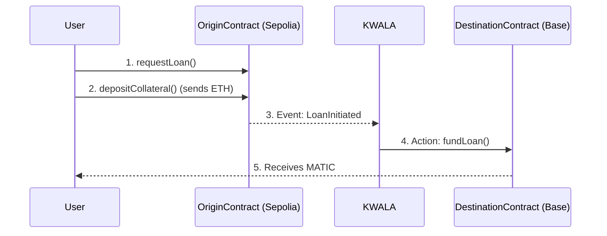

# ⚡ Instant: Cross-Chain Lending Protocol


**Unlock your trapped assets. Borrow on Base, using your collateral on Ethereum, instantly.**

---

## 🚀 The Problem: Trapped Liquidity

In today's multi-chain world, DeFi liquidity is fragmented. Billions of dollars are locked on one chain (like Ethereum) while users need funds on another (like Base) for a new opportunity.

The current solutions are:
* **❌ Complex Bridges:** Slow, expensive, and require multiple swaps, leading to high slippage.
* **❌ High Risk:** Cross-chain bridges are the single biggest target for hackers in Web3.
* **❌ Bad UX:** Users have to wait for long finality periods and manage assets on multiple bridges.

## 💡 Our Solution: Don't Bridge. Borrow.

**Instant** is a serverless cross-chain lending protocol. It allows you to use your assets on one chain as collateral to *instantly* receive a loan on another chain.

* **Deposit ETH on Ethereum Sepolia.**
* **Instantly receive MATIC on Base Sepolia.**
* **Repay on Base, get your ETH back on Sepolia.**

The magic behind this is our serverless backend. Instead of building complex, high-risk, custom "listener" contracts, we use **KWALA** as our secure and robust automation engine to handle all cross-chain communication.

---

## 🏗️ Architecture

The "Instant" protocol replaces complex, brittle "reactive" contracts with a simple, robust, and serverless architecture powered by KWALA.

* **Origin Contract (on Ethereum Sepolia):** Holds the user's ETH collateral. Emits events like `LoanInitiated`.
* **Destination Contract (on Base Sepolia):** Mints and lends mock MATIC. Emits events like `LoanFullyRepaid`.
* **KWALA Workflows (The "Glue"):** A set of 4 serverless workflows that act as our cross-chain backend. They listen for events on one chain and trigger the corresponding function on the other, instantly.

### The "Borrow" Flow (Mermaid Diagram)



---

## ⚙️ How It Works

The entire protocol is automated by four KWALA workflows.

### 1. The "Borrow" Flow (Sepolia → Base)

1. **Request:** User calls `requestLoan()` on our OriginContract (Sepolia).
2. **Deposit:** The user then calls `depositCollateral()`, sending their ETH.
3. **Automate (KWALA):** The OriginContract emits `LoanInitiated`. A KWALA workflow hears this and instantly calls `fundLoan()` on the DestinationContract (Base Sepolia).
4. **Receive:** The DestinationContract mints and transfers the MATIC loan to the user's wallet on Base.

### 2. The "Repay" Flow (Base → Sepolia)

1. **Repay:** A user calls `repayLoan()` on the DestinationContract (Base Sepolia), sending their MATIC.
2. **Automate (KWALA):** The DestinationContract emits `LoanFullyRepaid`. A second KWALA workflow hears this and instantly calls `releaseCollateral()` on the OriginContract (Sepolia).
3. **Release:** The OriginContract releases the user's ETH collateral back to their wallet.

### 3. The "Liquidation" Flow (Base → Sepolia)

1. **Liquidate:** A liquidator calls `liquidateLoan()` on an overdue loan on Base Sepolia.
2. **Automate (KWALA):** The DestinationContract emits `LoanLiquidated`. A third KWALA workflow hears this and instantly calls `liquidateLoan()` on the OriginContract.
3. **Secure:** The ETH collateral is seized and sent to the protocol owner/treasury, securing the protocol.

---

## 🛠️ Tech Stack

* **Automation Layer:** KWALA
* **Origin Chain:** Ethereum Sepolia (Chain ID: 11155111)
* **Destination Chain:** Base Sepolia (Chain ID: 84532)
* **Smart Contracts:** Solidity
* **Price Feeds:** Chainlink Oracles (ETH/USD, MATIC/USD)
* **Frontend:** Next.js, React, Shadcn/UI
* **Libraries:** Ethers.js / Web3.js
* **Deployment:** Vercel

---

## 🔗 Deployed Contracts

### On Ethereum Sepolia (Chain ID: 11155111)
* **OriginContract:** `[YOUR_SEPOLIA_ORIGIN_CONTRACT_ADDRESS]`
* **RiskAssessmentModule:** `[YOUR_SEPOLIA_RISK_MODULE_ADDRESS]`
* **InterestRateOracle:** `[YOUR_SEPOLIA_INTEREST_ORACLE_ADDRESS]`

### On Base Sepolia (Chain ID: 84532)
* **DestinationContract:** `[YOUR_BASE_SEPOLIA_DESTINATION_CONTRACT_ADDRESS]`
* **MATIC (Mock):** `[YOUR_BASE_SEPOLIA_MOCK_MATIC_ADDRESS]`

---

## 🚀 Running the Frontend Locally

1. Clone the repository:
```bash
git clone [YOUR_GITHUB_REPO_URL]
cd instant-lending-frontend
```

2. Install dependencies:
```bash
npm install
# or
yarn install
```

3. Run the development server:
```bash
npm run dev
# or
yarn dev
```

4. Open [http://localhost:3000](http://localhost:3000) in your browser.

---

## 🗺️ Future Roadmap

* **More Chains:** Add support for Arbitrum, Polygon, and other popular EVM chains.
* **More Assets:** Allow collateral and loans in USDC, wBTC, and other tokens.
* **Decentralized Liquidators:** Create a KWALA workflow that any user can trigger to run a decentralized liquidateLoan bot.
* **Dynamic Rates:** Fully implement the InterestRateOracle to create variable rates based on protocol utilization.

---

## 📄 License

This project is licensed under the MIT License.